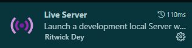

# Calculator

> -   Made with pure typescript no framework
> -   Unit tests made with Jest
> -   All functions a commun calculator has
> -   Simple and usefull

## Getting Started

> To install you will need to have git, npm and node.js pre installed

**:**

```bash
https://github.com/RobertSDM/calculator.git
```

**First copie the github repositorie, and in a terminal run the command:\*\***

```bash
git clone https://github.com/RobertSDM/calculator.git
```

**Then move into the project directory:**

```bash
cd ./calculator
```

**In the directory run the command:**

```bash
npm install
#or
pnpm install

```

**You will need to be shure that typescript is installed globaly. If you aren't sure, run:**

```bash
npm install typescript -g
```

**To run the backend:**

```bash
npm start
```

**And finally, to run the front-end open the .html file in the folder dist, but if you want to have a live preview of what you do in the code download one of these extensions if you are in vscode:**

>  \
> 

## To be added

-   The function of deleting one number at a time
-   The history of recent equations the user have done
